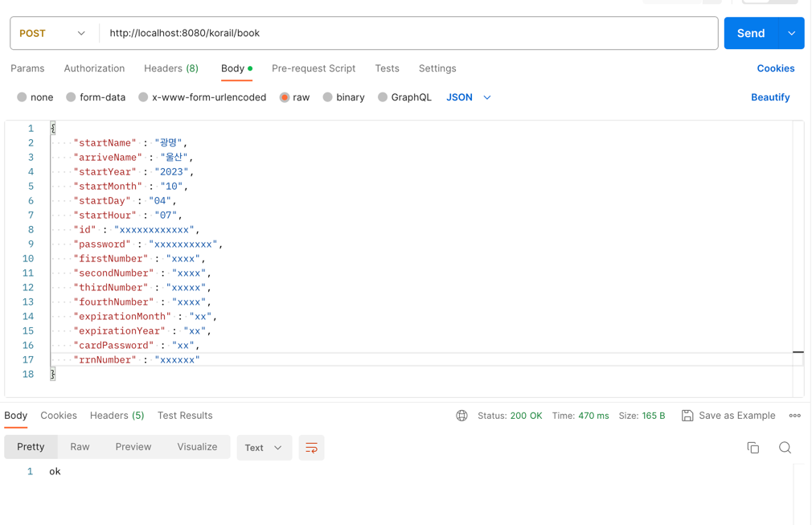
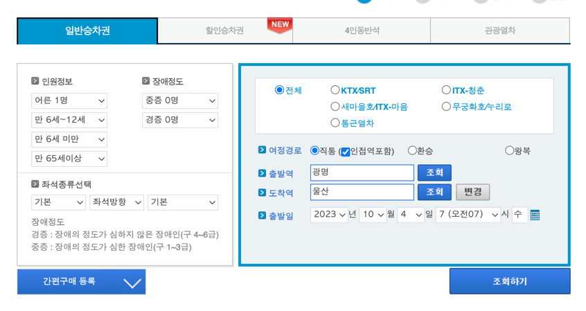
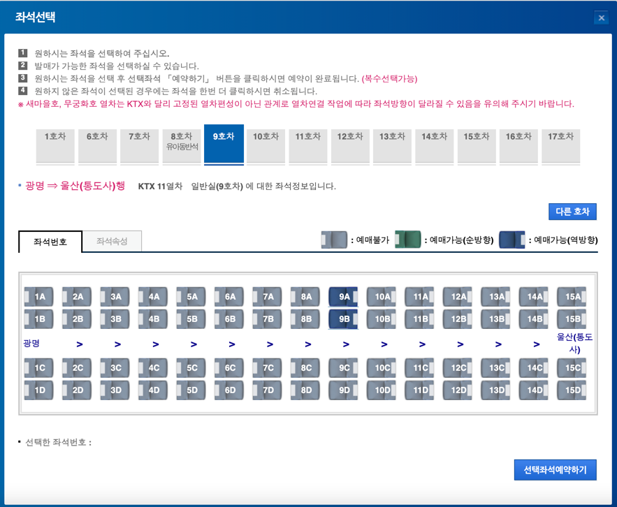
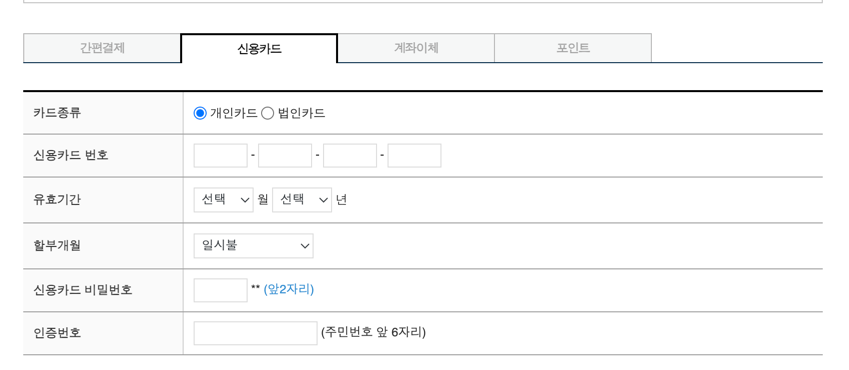

# 기차표 예약시스템
코레일 KTX 기차표 예약시스템

#### 목적
- 명절 때 취소표를 예약하기 위해 (광명 <-> 울산)
- KTX를 타면 시간을 절약할 수 있음

#### 일정
- 23.09.29 ~ 23.10.02 (추석연휴..)

## 프로젝트 스펙
- Server Framework : SpringBoot 2.7.x
- Build Tool : Gradle Groovy
- Language : Java 11
- Library : Selenium

## 내용
- Selenium을 이용하여 열차표 자동 예매
- API를 통해 예약
- 비동기 서비스
- (개발 전) 예매완료 및 오류 발생시 알림

---



````
    // booking
    private String startName;   // 출발지역
    private String arriveName;  // 도착지역
    private String startYear;   // 년(조회)
    private String startMonth;  // 월(조회)
    private String startDay;    // 일(조회)
    private String startHour;   // 시간(조회)

    // login
    private String id;  // 코레일 id
    private String password;    // 코레일 password

    // payment
    private String firstNumber;     // 신용카드 첫번째 4자리
    private String secondNumber;    // 신용카드 두번째 4자리
    private String thirdNumber;     //신용카드 세번째 4자리
    private String fourthNumber;    // 신용카드 네번째 4자리
    private String expirationMonth; // 월 (유효기간)
    private String expirationYear;  // 년도 (유효기간)
    private String cardPassword;    // 카드 비밀번호 앞 2자리
    private String rrnNumber;       // 주민등록번호 앞 6자리
````

#### 기능
1. 코레일 로그인


2. 예약날짜 조회


3. 좌석선택 및 예약


4. 결제
